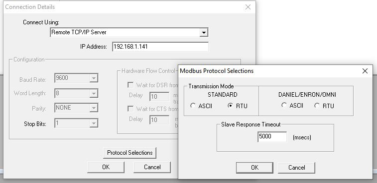
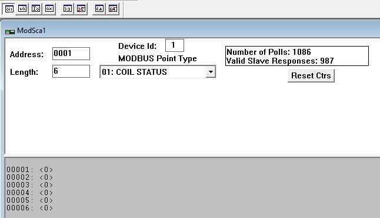
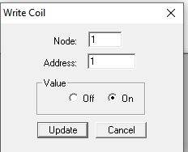
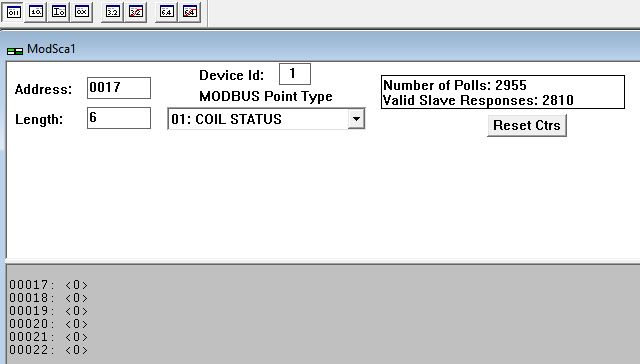

# Per controllare moxa E1214

impostare l'indirizzo Ip del Moxa.

Il modbus tcp comunica sulla porta 502

impostare il modScan con l'indirizzo Ip e la porta

## Leggere e settare DO

Per leggere e settare i DO impostati come DO quindi i relè in uscita è si imposta il modScan per leggere 01:COIL STATUS e gli address da 0001 per una lunghezza di 6

a questo punto cliccando due volte si può cambiare il valore:

## Leggere e settare DO in pulse output

Per leggere e settare i DO impostati come pulse output quindi i relè in uscita si imposta il modScan per leggere 01:COIL STATUS e gli address 0017 per una lunghezza di 6

